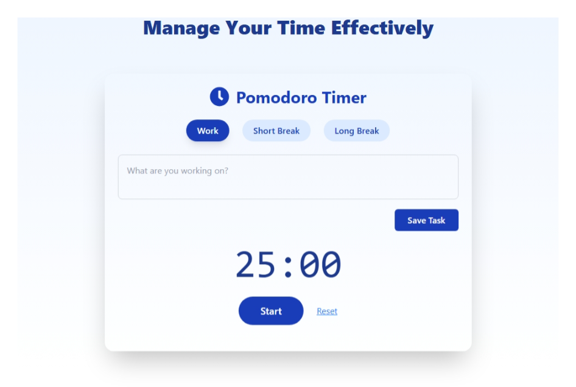
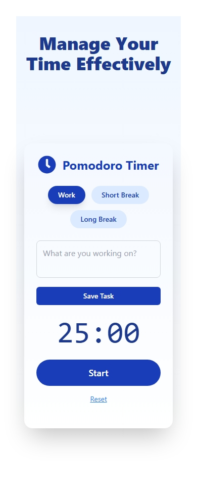

### Overview
This is a simple, responsive web application built to help people stay productive using the Pomodoro Technique. The idea is to work for a set amount of time, then take short breaks to rest and recharge.
The app has a clean interface, works well on both desktop and mobile, and makes it easy to start, pause, and reset your work sessions. It also lets you enter your current task so you can stay focused on what matters.

### Screenshots
- 
- 

### Pain Point
- Help people work in short, focused sessions to get more done.

- Prevent burnout by taking regular breaks.

- Keep users focused by showing their current task.

- Make the timer accessible anywhere, on any device.

### Features
- Three Modes:

- Work Session (default: 25 minutes)

- Short Break (default: 5 minutes)

- Long Break (default: 15 minutes, after every 4 work sessions)

- Durations: Change work and break times to fit your schedule.

- Task Input: Enter what you’re working on before starting the timer.

- Audio Alert: Plays when a session ends.

- Automatic Mode Switching: Moves to the next session type without you clicking anything.

- Responsive Design: Works well on phones, tablets, and computers.

### Who It’s For
- Students studying for exams.

- Remote workers and freelancers who want better focus.

- Office professionals managing multiple tasks.

- Creatives who need to balance work and rest.

### The Problem It Solves
It’s easy to lose track of time when working, which can lead to mental fatigue and less productivity. Many timers are either too basic or too complicated.
This Pomodoro Timer keeps things simple  you see your task, you see the time, and you get reminded when to take a break.

### Tools Used
- React for building the interface.

- Tailwind CSS for styling.

- React Icons for UI icons.

- HTML5 Audio for the alert sound.

### How It Works
- You start by entering your task.

- Pick whether you want to work, take a short break, or take a long break.

- Press Start — the timer begins and your task input hides so you stay focused.

- When the time runs out, you hear a sound and the input shows again.

- You can pause, reset, or change the session type anytime.

### Challenges & Solutions
## Challenge: 
- I wanted the task input to disappear while the timer was running but reappear when it finished or was reset.
 ## Solution: 
 - I used React’s state and conditional rendering to show or hide the input at the right time without affecting the timer.

### Hosting
vercel

